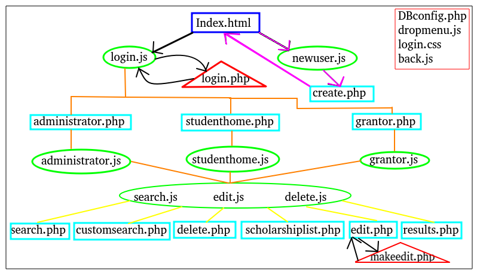

# This is a full working Website using mySQL, PHP, Javascript, HTML, CSS.

This is an implementation of student scholarship database. The idea here is that users would be able to create an account, log into a unique profile, and apply for and view scholarships that match their criteria. Grantor users can also create accounts, log into unique profiles, and set up scholarships for students to apply for.

Scholarship Finders model is simple, a student with characteristics a, b, and c can me matched with a donor who would like to give money to a student with characteristics a, b and c. Portions of student data would be unavailable for the student to edit such as previous grades received from an institution. Other portions of data would need to be edited regularly by the student such as majors, sports played, and personal income. Ideally the items unavailable for edit would come from a secured source preferably the school itself which contained gpa’s. Of course with no real users as it stands information has been inserted into several pretend students records for ease of sampling. Information needed from a grantor would be able to be furnished from the individual wishing to host a scholarship. This information includes the amount of money in total and the number of students it should be dispersed among. This is as simple as a grantor wishing that $25,000 be split among 5 qualified meaning 5 separate awards of $5,000 apiece. The grantor sets the standard of qualification by filling out an eligibility form. This process is almost identical to the student sign up as it asks the grantor to make requirements the same as the information available for students.  Grantors are presented with a list of qualified applicants while the information is omitting personal details such as the name of the student. Administrator accounts can clean up and make edits to line items as necessary as well as delete users if desired.

## What This Is

The application simply put is a search engine for scholarships. There are two main types of account which can be set up to use the application. First, the primary users, the ‘student’ account. This begins when a student lands on the website and registers for an account. The current model is based on a simple fill out form completed at the users discretion. The given information is enough to begin searching for scholarships that best match that student. The goal of a student account is to provided relevant scholarship information to the student. The second account type is the grantor. This is an individual who wishes to pledge money to students that meet their requested criteria. The purpose of a grantor account is to match the account holder with students that best match their requested criteria. The grantor may then decide on an individual basis to give an award or not. The last type of account is the administrator account which holds details of each person engaging with the program as well as authority to manipulate, see, store, collect data as they see fit.

## How Does it Work?
The database Is simply constructed and consists of eight core tables. The first two I will discuss are best described as administrative tables. Admin is a table used by the DBM to identify their credentials as administrative, which comes with certain elevated privileges pertaining to site maintenance. The second administrative table is UserLogin  which is a table of usernames, passwords and special ID numbers used for identification. The next two tables create the core account types and most of the user experience. Firstly Student, is a table accessed by student users containing personal information such as name, the ID number previously mentioned in the UserLogin table. This also holds the information relating to awards won. The second core user type and table is Grantor, this similarly holds name and ID numbers of grantor users as well as basics on scholarships sponsored.

The next two tables are essential data relevant to student user accounts making the basis for their profile to be found as well as meet eligibility criteria. First will be StateRecord, in an ideal situation this data would be sourced from a secure source such as an educational institution or state records office. This data includes grade point averages and other key notes from previous schools (including high school) attended. Again, in a perfect situation this data would also be completely non modifiable by student users and especially not left to input based on the honor system. This however is not completely the case in this application. I do have to ask users to simulate (or input themselves) the data that would be expected from  a state sanctioned authority. Once that data is in, it is un-modifiable by the traditional student user. This dilemma can be easily worked through and scaled to handle inputs from an outside source but with limited resources currently at my disposal this project will rely on completely simulated data.

Lastly in student core components is the ProvidedRecord table. This is the most important part of a good student experience. Elements comprised herein are all of the student modifiable settings. These are dynamic experiences that students can feature in their profile to make themselves be found by grantors.  Elements include some personal data, email, and again ID. The values most desired are statistics of a students extracurricular behavior. Service hours completed in the community, a particular students prospective major in college, weather or not she played sports, or perhaps is involved in an honors program or even a study abroad student. The more complete the record, the better likelihood of being recognized by the search features. The ProvidedRecord table functions like a mirror to a very related table called Eligibility which will be discussed next. To be found in a scholarship search it is recommended to student users to accurately and completely fill in their personal extracurricular data as soon as they can so that they may receive money. Extracurricular data is matched on an individual basis to qualifiers that are needed to win a scholarship. An overwhelming majority of line items in this table are also represented in the next table Eligibility and this is why I call it a mirror, because just like in a mirror you would expect to see an exact copy of yourself looking back at you, students hope to have an exact match with high dollar scholarship awards.

Eligibility is the link between students and scholarships. This table details the eligibility requirements for someone to consider themselves ‘in the running’ so to speak for a particular award. These items are located in a students table ProvidedRecord. Student users will have no direct interaction with anything not in is own two core tables. This table is populated and updated by users in the group ‘Grantor.’ Eligibility is also tightly linked to grantor users so that they may keep track of awards they are sponsoring. This table in a way acts like a public access point for searches and remain un-modifiable by anyone who shouldn't be.  Eligibility table is the first and most important core table of the grantor user.

The second core table for grantor users is the Scholarship table. This holds information about the scholarship that a student would not be able to use as an identifier for a match. This includes the total value of the award, the number of students the award is to be divided among, as well as the number of awards that have yet to be handed out.  All of this information if furnished by a grantor user who is pledging to sponsor in accordance with the details provided in their setup. This concept of total freedom of the grantor user to make any scholarship they desire does come with drawbacks. Namely that a grantor user may not be faithful and has no intention to make good on any promise of money. This is not currently preventable at this stage in development. This, like the state record dilemma, would need to be resolved if this project ever moves past early prototype phase. Surly information about the scholarships in question could be resolved with a verification process or an escrow account of some kind, but this is simply not feasible for a team of one to accomplish. Scholarships are linked to eligibility requirements by a unique ID number and certain table items are available for read only purposes by student users when searches are preformed.

I believe this data model to be in the BCNF. I make this judgment on the fact that each table has as unique ID field that is used to link every other data element in the row to it. The value ID, in every table, is a super key for every dependency in that table. Other elements can not be used alone to uniquely identify any single table. With that being said, I'm sure that any table here could be identified by other features, or a combination of elements with enough trial I believe this database to hold to the BCNF.

A few of the applications key basic features have been thoughtfully outlined in the second part of this project and I will reiterate them here again now for reference. First feature is the ability to add yourself as a user if you are a prospective student. Once a user decides to set up an account the registration process will walk them through a questionnaire that will populate the appropriate tables that are linked to a student held account. In this prototype both the states records, and the personal details are provided by the user. The portion below administrative, is the sign up questionnaire  which represents the state simulated record. From this we gather, high school gpa, previous college gpa, and courses taken. These bare-bones requirements will need to be made more through once better sign up policies are implemented. I believe there is a great deal of information that I am not accounting for on a StateRecord which is of use and would be worth noting in the database.  Understanding this, I have pressed on with only a few generic requirements that satisfy most importantly, weather or not two separate records could be easily maintained by one student ID number. Throughout the creation of this project there have been many tribulations, however I believe still that it is perfectly reasonable for this application to have two separate records for a student with different access levels.

Just as important for the process as adding students, is the creation of something that draws the student users in the first place. This is the ability to create new scholarships for students to compete for and win. Grantors will fill out a simple requirements form walking them through the requirements. Some standout information is the name of the award (John Dailey Memorial Fund), the amount in dollars of the award, the number of students will will receive a portion of the total award and a link to an eligibility table which contains all of the match-able items. Grantors have open access currently and are assumed to be trusted and verified users with a taste for honesty.

Students ability to search for open scholarships is the third crucial item that needs to be offered to prospective clients. Once a student account has been made, they will need to run an initial search (as it stands now) to populate their prospective awards stats. After that they are still left with several clever methods of searching or just shopping through scholarships at the request of their individual search criteria. There is a search feature available to student users that is similar to an ‘advanced search’ button commonly found on web browsers. This offers users fine tuning methods over their search results and can display outcomes to the user requesting a search. Also a built in search is included in the student profile that will appear as a link in their respective home screen. This runs SQL query's in the background and produces results that are applicable to the student based on their user data. This saves the time of a user potentially preforming a search for scholarships they are for whatever reason completely not qualified for. While the advanced search option is available I expect is use to be mostly by persons wishing to see whats out there in terms of scholarship awards.

A grantors ability to search for students is another feature hopefully well implemented in this application. Just as a student would be interested in seeing what is available to them, I am assuming that grantors would want to see some information of students eligible or otherwise interested in their scholarship. This feature will return non identifiable (no full names at a minimum for now) to the grantor who then would decide if they wish to provide funds to the applying student.

Users ability to modify selected components of their record also appears to be a rather critical element of good data application builds. It is my hope that as students progress in their educational endeavor that they would need to update relevant parts of their extracurricular s table (ProvidedRecord). If a student spent a summer break helping out in the city they should need to update their service hours counter to accurately reflect the change and be rewarded for their hard work by becoming more visible to prospective grantors. It is my impression that this should be developed for both primary types of users. A grantor should be allowed to change scholarship and eligibility criteria as they see necessary, as well as students should change values in their table as the changes occur during their educational tenure.

The premier advanced function in this application is the competitive search results that are generated and the details of what other winners averaged In terms of qualifying features. When a student logs in they are brought to their home page and are given an option to see scholarships that they are eligible for. In this window results detail the award that they are eligible for as well as the average gpa of all students who have previously won that award and the average gpa’s of other students that are currently qualified. For example a student may notice that they have technically qualified for an award, the average student that has been given that award had a much higher or lower average then themselves. There are a few other statistics that are presented to the user such as weather or not more men or women had been given the award previously.

### Running

Users would need to have installed mySQL, PHP, and have a working server to communicate with. In the folder labeled 'sql', you will find the needed SQL statements to create and fill your database. Move web files to server and connect. Landing page is index.html.

## Authors

* **David P. Turner** - https://github.com/dturner1189
